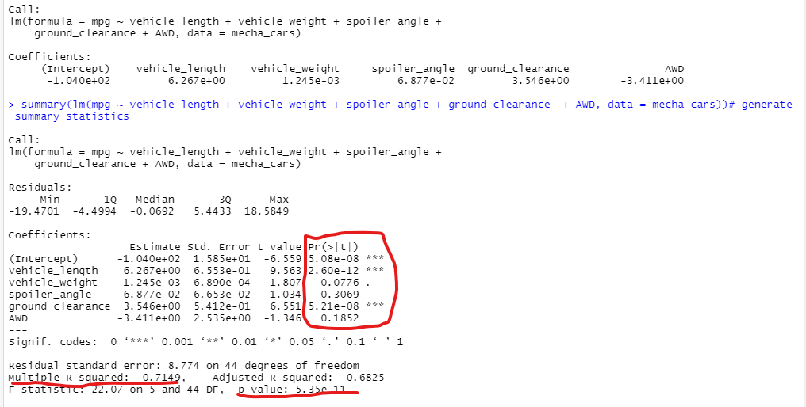
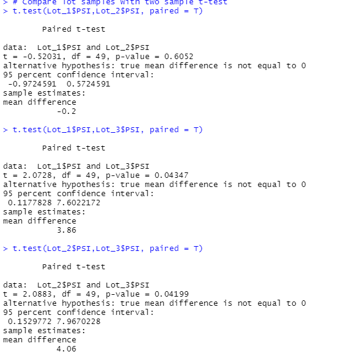

# Mecha Car Statistical Challenge
## Predicting MPG - Multiple Linear Regression (Deliverable 1)
The oputput from our multiple linear regression model is shown below.

### Which variables/coefficients provide non-random amount of variance to the mpg values?
From  the output table above both vehicle length and ground clearance provide non-random variance.  We can conclude this since both of their Pr values are less than 0.05.  The vehichle weight is close to meeting our threshold at a value of 0.078 but we would need additional data with analysis to definitavely conclude weight is a factor.

### Is the slope of the line zero?
Based on the p-value of 5.35e-11 being less than 0.05 we can reject the null hypothesis and say the slope is not zero.

### Does the model predit MPG of MechaCar prototypes effecitvely?
The model overall does a fair job of predicting the MPG since the R-squared value is .7149 or the model explains 71.5% of the MPG variance.  The model could be improved by collecting data on other car attributes.  The most likely attributes would be displacement, horsepower and rolling resistance.

## Suspenion Coil PSI Review (Deliverable 2)
## Summary Data for Suspenion Coil PSI Samples

The figure below provides summary statistics for PSI of all the coils and by Lot.

The mean and median for the coil sample population were as specified with values of 1498.8 and 1500 psi repsectively.  The variance and standard deviation for the sample population were as expected and did not indicate any cause for concern.

When reviewing the summary statistics for each lot, LOT 3 has an out of specification condition with variance of the coils.  The total variance exceeds 100 psi at 170 psi.  The other lots, Lot 1 and Lot 2, are clearly in specification on both mean and variance from coil to coil.  There is an issue with Lot 3 that warrants further investigation.

## Suspension Coil Sample vs. Population Analysis (Deliverable 3)

### Comparison of Lot Mean vs. Population Mean (Deliverable 3 Part 1)
T
he following hypotheses were used for the t-test of samples compared to the population:

H0: There is no statistical difference between the sample mean PSI and the population mean PSI if 1500.

Ha: There is a statistical difference between the sample mean PSI and the population PSI.  

An alpha = 0.05 was used for all tests.

The results of the t-test comparing all sample values of coil psi to the population mean of 1500 psi is shown below.

***Analysis of Results***
The p-value for all samples versus the population mean of 1500 was 0.06 which was more than our alpha of 0.05 thus we cannot reject H0.  The coil samples are not statistically different than the population mean of 1500 psi. 

### Comparison of Sample Means Across Lots (Deliverable 3 Part 2)
To compare the sample means across the different coil lots a paired t-test was used with an alpha of 0.05.

H0: There is no statistical difference between the sample mean PSI between the lots

Ha: There is a statistical difference between the sample mean PSI between lots.

The output of the tests are is shown below.

***Analysis or Results***
